## Deploy LogPaste to Amazon LightSail

**Warning**: These instructions assume an already initialized datastore on your S3 bucket. Once LogPaste 0.1.2 is released, this assumption won't be necessary.

Amazon LightSail is an attractive option for launching LogPaste to production for two main reasons:

- You can deploy entirely from Amazon's AWS dashboard, so you don't need to install any software.
- You can view LogPaste's server logs directly from your AWS dashboard.
- LightSail offers free TLS certificates for a custom domain.

The downside is that it doesn't fit within AWS's free tier, so hosting will cost $7 per month, as of this writing.

## Pre-requisites

You'll need:

- An Amazon AWS account
- A storage bucket and [IAM credentials](https://aws.amazon.com/iam/) on Amazon S3 or an S3-compatible storage service.

## Create a LogPaste container

Visit [Amazon LightSail's container management dashboard](https://lightsail.aws.amazon.com/ls/webapp/home/containers)

<kbd>

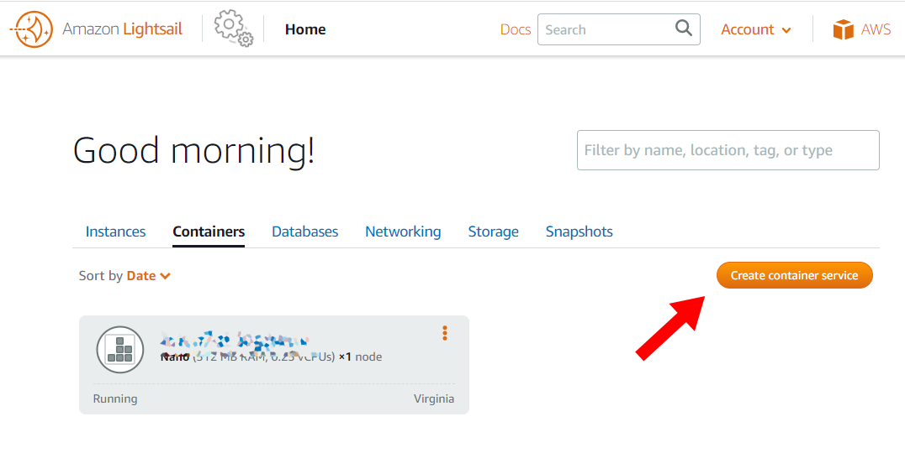

</kbd>

Choose a Nano server with 1x scale.

<kbd>

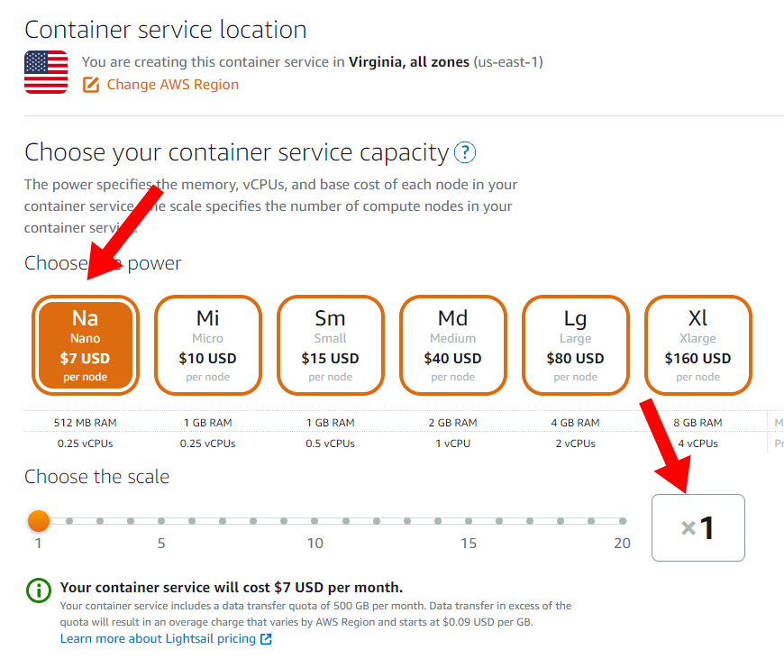

</kbd>

Click "Set up deployment" and then choose "Specify a custom deployment."

<kbd>

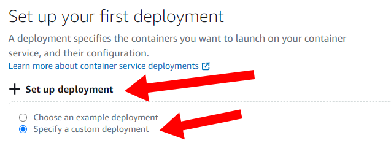

</kbd>

Enter the following information for your custom deployment:

- Container name: Choose whatever name you want, such as `yourcompany-logpaste`
- Image: `mtlynch/logpaste:0.2.5` (or whatever the [latest LogPaste version](https://github.com/mtlynch/logpaste/releases) is)
- Launch command: _leave blank_
- Environment variables

| Key                            | Value                                               |
| ------------------------------ | --------------------------------------------------- |
| `PORT`                         | 3001                                                |
| `PS_BEHIND_PROXY`              | "y"                                                 |
| `DB_REPLICA_URL`               | The S3 URL of your S3 bucket                        |
| `LITESTREAM_REGION`            | The region of your S3 bucket                        |
| `LITESTREAM_ACCESS_KEY_ID`     | The AWS access key ID from your IAM credentials     |
| `LITESTREAM_SECRET_ACCESS_KEY` | The AWS secret access key from your IAM credentials |

- Open ports: Choose port `3001`, protocol `HTTP`

<kbd>

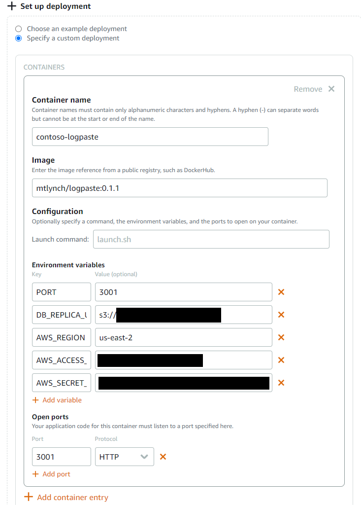

</kbd>

Under "Public Endpoint," select the container you created above:

<kbd>

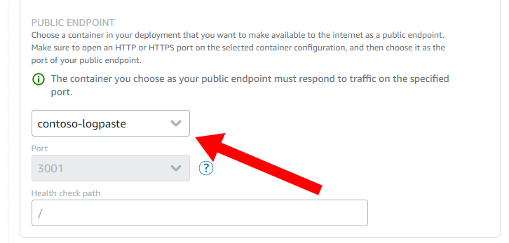

</kbd>

Choose a name for your service (it can be the same as your container name):

<kbd>

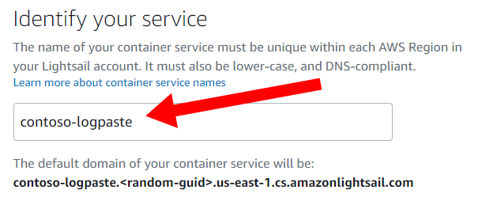

</kbd>

Finally, click "Create container service."

<kbd>

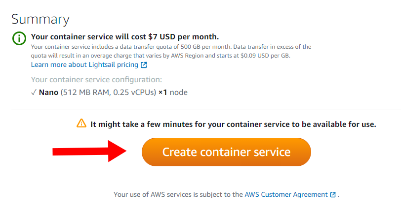

</kbd>

## Completing deployment

As LightSail deploys your image, you'll see a status of "Pending" for the container.

<kbd>

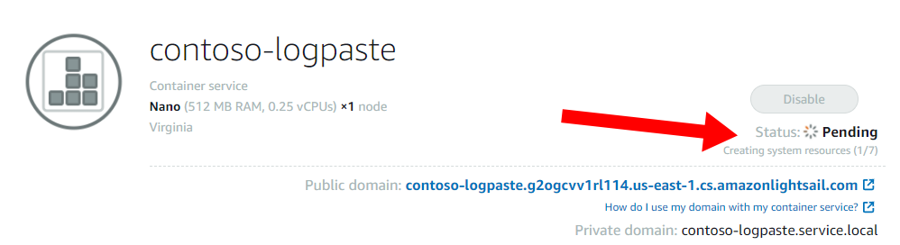

</kbd>

It will take LightSail about three to five minutes to deploy your instance for the first time. When deployment is complete, it will show a status of "Running."

<kbd>

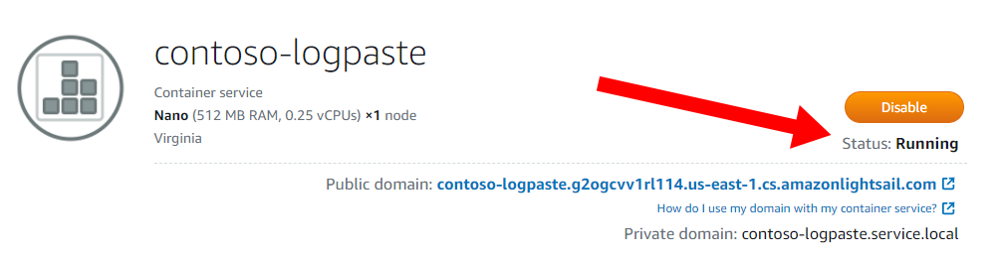

</kbd>

When your container is running, you can access it through the "Public domain" URL.

<kbd>

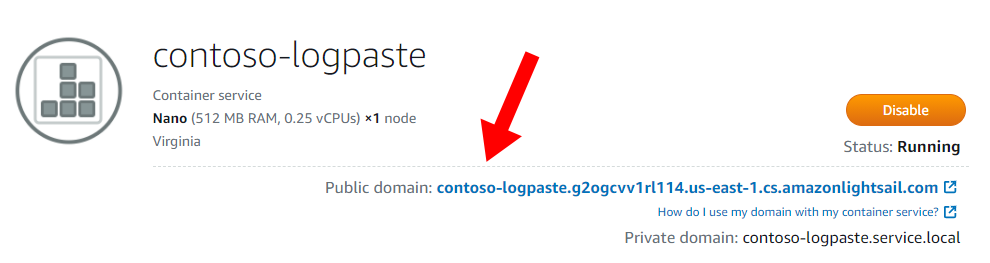

</kbd>

You can view server logs for your LogPaste instance by clicking "Open log" in the box next to your container.

<kbd>

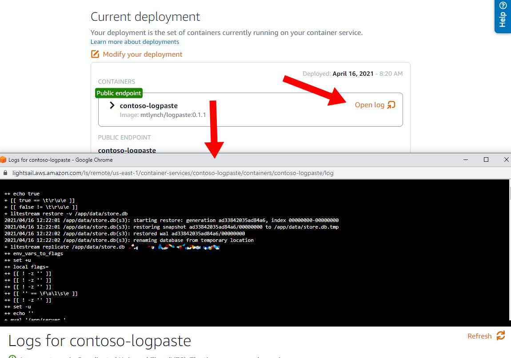

</kbd>
